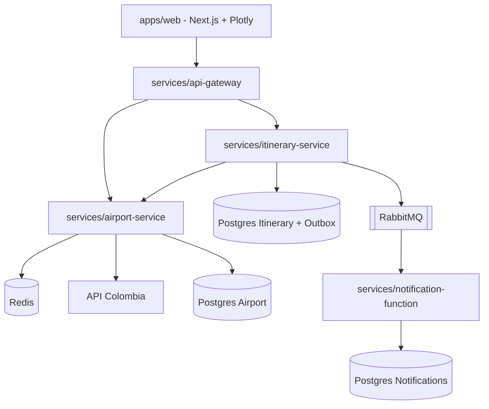

# Component diagram

```mermaid
flowchart TB
  WEB[apps/web - Next.js + Plotly]

  GW[services/api-gateway]

  AIR[services/airport-service]
  ITI[services/itinerary-service]
  NF[services/notification-function]

  PG1[(Postgres Airport)]
  PG2[(Postgres Itinerary + Outbox)]
  PG3[(Postgres Notifications)]
  REDIS[(Redis)]
  RMQ[[RabbitMQ]]
  COL[API Colombia]

  WEB --> GW
  GW --> AIR
  GW --> ITI
  ITI --> AIR
  AIR --> REDIS
  AIR --> COL
  AIR --> PG1
  ITI --> PG2
  ITI --> RMQ
  RMQ --> NF
  NF --> PG3
```

## Notes

- Each service package is independently buildable/deployable.
- Contracts live in `packages/contracts` and `packages/proto` (not shown as runtime boxes).
