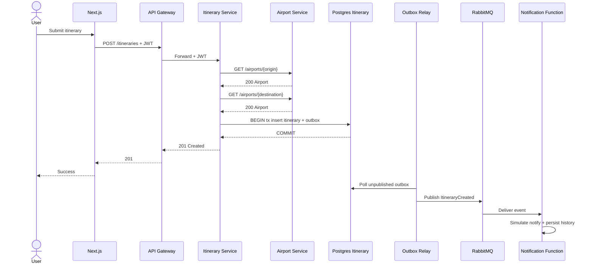
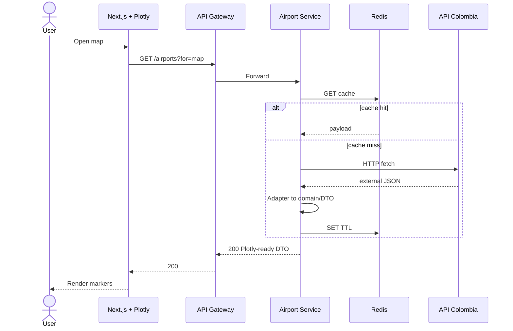
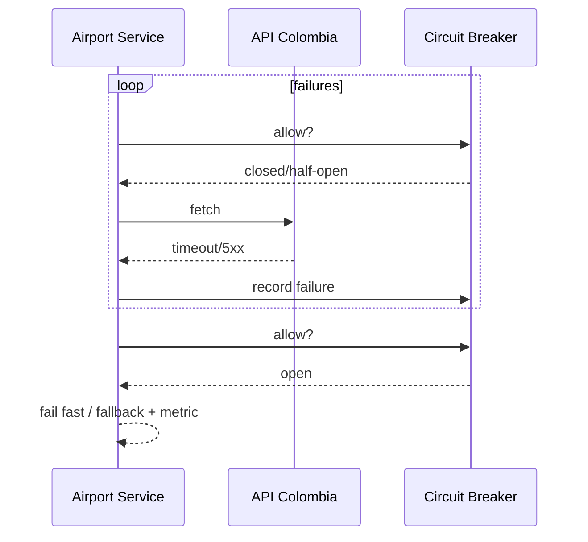

# Sequence diagrams

## Create itinerary (sync path + async notify)

```mermaid
sequenceDiagram
  actor U as User
  participant W as Next.js
  participant G as API Gateway
  participant I as Itinerary Service
  participant A as Airport Service
  participant DB as Postgres Itinerary
  participant R as Outbox Relay
  participant Q as RabbitMQ
  participant F as Notification Function

  U->>W: Submit itinerary
  W->>G: POST /itineraries + JWT
  G->>I: Forward + JWT
  I->>A: GET /airports/{origin}
  A-->>I: 200 Airport
  I->>A: GET /airports/{destination}
  A-->>I: 200 Airport
  I->>DB: BEGIN tx insert itinerary + outbox
  DB-->>I: COMMIT
  I-->>G: 201 Created
  G-->>W: 201
  W-->>U: Success

  R->>DB: Poll unpublished outbox
  R->>Q: Publish ItineraryCreated
  Q->>F: Deliver event
  F->>F: Simulate notify + persist history
```

## Map load (airports)

```mermaid
sequenceDiagram
  actor U as User
  participant W as Next.js + Plotly
  participant G as API Gateway
  participant A as Airport Service
  participant C as Redis
  participant X as API Colombia

  U->>W: Open map
  W->>G: GET /airports?for=map
  G->>A: Forward
  A->>C: GET cache
  alt cache hit
    C-->>A: payload
  else cache miss
    A->>X: HTTP fetch
    X-->>A: external JSON
    A->>A: Adapter to domain/DTO
    A->>C: SET TTL
  end
  A-->>G: 200 Plotly-ready DTO
  G-->>W: 200
  W-->>U: Render markers
```

## Resilience demo (circuit breaker)

```mermaid
sequenceDiagram
  participant A as Airport Service
  participant X as API Colombia
  participant CB as Circuit Breaker

  loop failures
    A->>CB: allow?
    CB-->>A: closed/half-open
    A->>X: fetch
    X-->>A: timeout/5xx
    A->>CB: record failure
  end
  A->>CB: allow?
  CB-->>A: open
  A-->>A: fail fast / fallback + metric
```
